# How Instai Works — Complete Technical Deep Dive

> A detailed notebook explaining every layer of the Instai architecture, the problems we faced, and how we solved them.

---

## Table of Contents

1. [The Big Picture](#1-the-big-picture)
2. [Architecture Overview](#2-architecture-overview)
3. [The Scraping Engine](#3-the-scraping-engine)
4. [Anti-Detection: How We Bypass Instagram's Defenses](#4-anti-detection-how-we-bypass-instagrams-defenses)
5. [The Database Layer (Turso)](#5-the-database-layer-turso)
6. [The Image Proxy](#6-the-image-proxy)
7. [The API Layer (FastAPI)](#7-the-api-layer-fastapi)
8. [The Frontend (Next.js)](#8-the-frontend-nextjs)
9. [Data Flow: End to End](#9-data-flow-end-to-end)
10. [Setbacks & How We Solved Them](#10-setbacks--how-we-solved-them)
11. [File Map](#11-file-map)

---

## 1. The Big Picture

Instai is an Instagram profile viewer that lets you look up **any public Instagram profile** by username. No login. No passwords. No Instagram account needed.

### What it does:
- Enter a username → see their profile, stats, and recent posts
- View engagement analytics (likes, comments, averages)
- Download profile pictures, post images, and videos/reels
- All data is cached in a cloud database (Turso) for fast repeat lookups

### The core idea:

```
User types "cristiano" → Instai scrapes Instagram's public API →
Stores data in Turso DB → Displays profile + posts + analytics
```

---

## 2. Architecture Overview

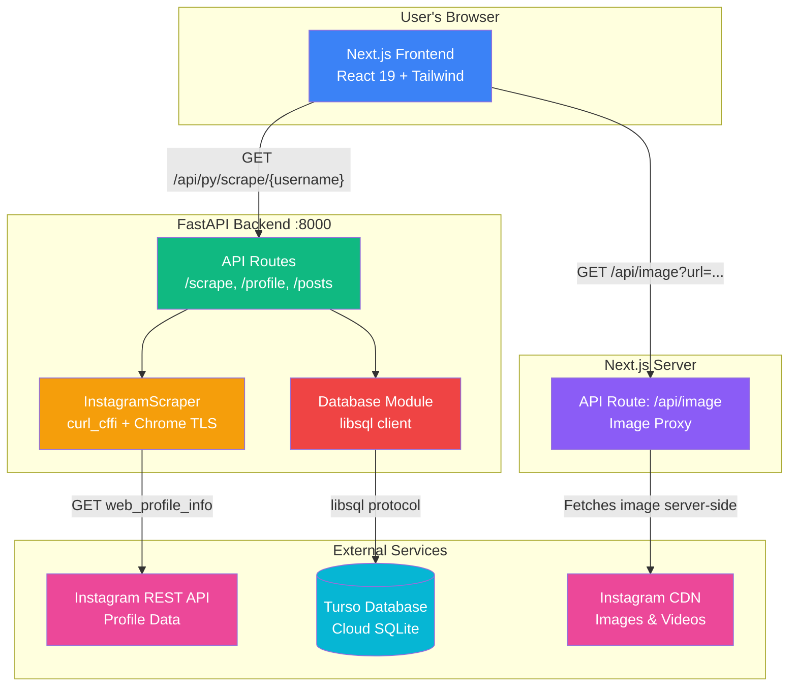
```mermaid
graph TB
    subgraph "User's Browser"
        A[Next.js Frontend<br/>React 19 + Tailwind]
    end

    subgraph "Next.js Server"
        B[API Route: /api/image<br/>Image Proxy]
    end

    subgraph "FastAPI Backend :8000"
        C[API Routes<br/>/scrape, /profile, /posts]
        D[InstagramScraper<br/>curl_cffi + Chrome TLS]
        E[Database Module<br/>libsql client]
    end

    subgraph "External Services"
        F[(Turso Database<br/>Cloud SQLite)]
        G[Instagram CDN<br/>Images & Videos]
        H[Instagram REST API<br/>Profile Data]
    end

    A -->|"GET /api/py/scrape/{username}"| C
    A -->|"GET /api/image?url=..."| B
    B -->|"Fetches image server-side"| G
    C --> D
    C --> E
    D -->|"GET web_profile_info"| H
    E -->|"libsql protocol"| F

    style A fill:#3b82f6,color:#fff
    style B fill:#8b5cf6,color:#fff
    style C fill:#10b981,color:#fff
    style D fill:#f59e0b,color:#fff
    style E fill:#ef4444,color:#fff
    style F fill:#06b6d4,color:#fff
    style G fill:#ec4899,color:#fff
    style H fill:#ec4899,color:#fff
```

### Two Servers, One App

| Server | Port | Role |
|--------|------|------|
| **Next.js** | 3000 | Frontend UI + Image proxy API route |
| **FastAPI** | 8000 | Scraping engine + Data API |

Next.js proxies `/api/py/*` requests to FastAPI via its `rewrites` config, so the browser only talks to port 3000.

---

## 3. The Scraping Engine

### The Key Endpoint

Instagram has an internal REST API that returns profile data as JSON:

```
GET https://i.instagram.com/api/v1/users/web_profile_info/?username={username}
```

This is the **same endpoint** Instagram's own web app uses when you visit someone's profile. It's not a hack — it's how Instagram works.

### What We Get Back

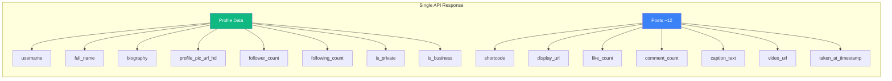
```mermaid
graph LR
    subgraph "Single API Response"
        A[Profile Data] --> A1[username]
        A --> A2[full_name]
        A --> A3[biography]
        A --> A4[profile_pic_url_hd]
        A --> A5[follower_count]
        A --> A6[following_count]
        A --> A7[is_private]
        A --> A8[is_business]

        B[Posts ~12] --> B1[shortcode]
        B --> B2[display_url]
        B --> B3[like_count]
        B --> B4[comment_count]
        B --> B5[caption_text]
        B --> B6[video_url]
        B --> B7[taken_at_timestamp]
    end

    style A fill:#10b981,color:#fff
    style B fill:#3b82f6,color:#fff
```

**One request gives us everything** — profile info AND the ~12 most recent posts. No pagination needed for the basic view.

### Required Headers

The API won't respond without these specific headers:

```python
headers = {
    "User-Agent": "Mozilla/5.0 (Windows NT 10.0; Win64; x64) ...",  # Pretend to be Chrome
    "X-IG-App-ID": "936619743392459",  # Instagram's own web app ID
    "X-Requested-With": "XMLHttpRequest",
    "Accept": "application/json",
    "Referer": "https://www.instagram.com/",
    "Origin": "https://www.instagram.com",
}
```

The most critical one is `X-IG-App-ID` — without it, Instagram returns HTML instead of JSON.

### Response Parsing

The response JSON is nested. Here's how we map it to our schema:

```
API Response Path                          → Our Field
─────────────────────────────────────────────────────────
data.user.id                               → pk
data.user.username                         → username
data.user.full_name                        → full_name
data.user.biography                        → biography
data.user.profile_pic_url_hd              → profile_pic_url
data.user.edge_followed_by.count          → follower_count
data.user.edge_follow.count               → following_count
data.user.edge_owner_to_timeline_media.count → media_count
data.user.is_business_account             → is_business
data.user.is_private                      → is_private

Posts are under: data.user.edge_owner_to_timeline_media.edges[]

edge.node.id                               → pk
edge.node.shortcode                        → code
edge.node.taken_at_timestamp              → taken_at (unix → ISO)
edge.node.__typename                       → media_type
    GraphImage  → 1 (photo)
    GraphVideo  → 2 (video/reel)
    GraphSidecar → 8 (carousel)
edge.node.display_url                     → thumbnail_url
edge.node.edge_liked_by.count             → like_count
edge.node.edge_media_to_comment.count     → comment_count
edge.node.edge_media_to_caption.edges[0].node.text → caption_text
edge.node.video_url                       → video_url (videos only)
edge.node.edge_sidecar_to_children.edges  → resources (carousels only)
```

### File: `api/utils/scraper.py`

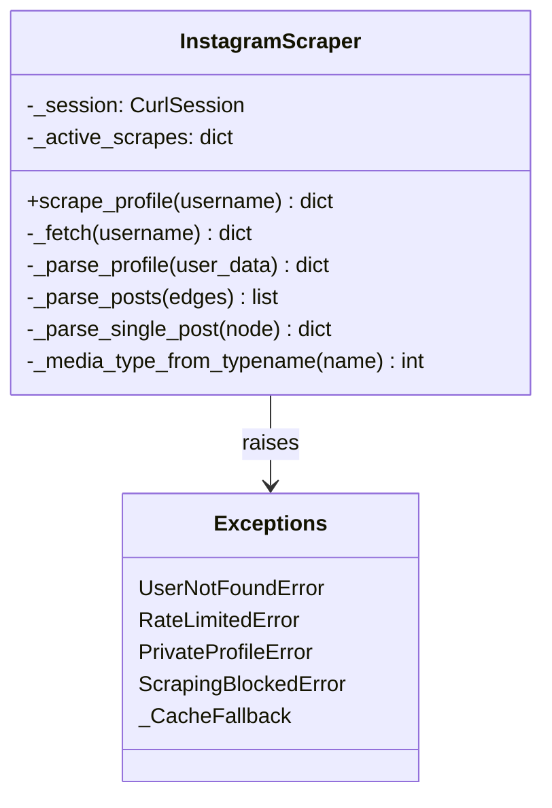
```mermaid
classDiagram
    class InstagramScraper {
        -_session: CurlSession
        -_active_scrapes: dict
        +scrape_profile(username) dict
        -_fetch(username) dict
        -_parse_profile(user_data) dict
        -_parse_posts(edges) list
        -_parse_single_post(node) dict
        -_media_type_from_typename(name) int
    }

    class Exceptions {
        UserNotFoundError
        RateLimitedError
        PrivateProfileError
        ScrapingBlockedError
        _CacheFallback
    }

    InstagramScraper --> Exceptions : raises
```

---

## 4. Anti-Detection: How We Bypass Instagram's Defenses

Instagram has **4 layers of bot detection**. We handle the most critical one:

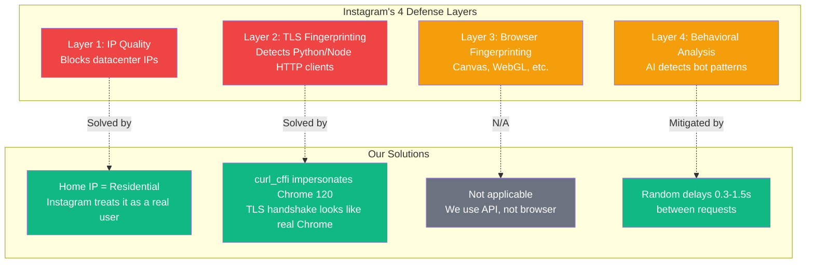
```mermaid
graph TD
    subgraph "Instagram's 4 Defense Layers"
        L1[Layer 1: IP Quality<br/>Blocks datacenter IPs]
        L2[Layer 2: TLS Fingerprinting<br/>Detects Python/Node HTTP clients]
        L3[Layer 3: Browser Fingerprinting<br/>Canvas, WebGL, etc.]
        L4[Layer 4: Behavioral Analysis<br/>AI detects bot patterns]
    end

    subgraph "Our Solutions"
        S1[Home IP = Residential<br/>Instagram treats it as a real user]
        S2[curl_cffi impersonates Chrome 120<br/>TLS handshake looks like real Chrome]
        S3[Not applicable<br/>We use API, not browser]
        S4[Random delays 0.3-1.5s<br/>between requests]
    end

    L1 -.->|"Solved by"| S1
    L2 -.->|"Solved by"| S2
    L3 -.->|"N/A"| S3
    L4 -.->|"Mitigated by"| S4

    style L1 fill:#ef4444,color:#fff
    style L2 fill:#ef4444,color:#fff
    style L3 fill:#f59e0b,color:#fff
    style L4 fill:#f59e0b,color:#fff
    style S1 fill:#10b981,color:#fff
    style S2 fill:#10b981,color:#fff
    style S3 fill:#6b7280,color:#fff
    style S4 fill:#10b981,color:#fff
```

### Layer 2 Deep Dive: TLS Fingerprinting

This is the most interesting defense. When your browser connects to Instagram via HTTPS, the very first thing that happens is a **TLS handshake**. This handshake includes:

- Which cipher suites you support
- Which TLS extensions you use
- The order of all of the above

Every HTTP client has a unique "fingerprint" from this handshake:

```
Python requests  → JA3: 771,4866-4867-4865-49196...  ← Instagram knows this is a bot
Node.js fetch    → JA3: 771,4866-4867-4865-49199...  ← Instagram knows this is a bot
Chrome 120       → JA3: 771,4865-4866-4867-49195...  ← Instagram thinks this is a real user
```

**Our solution: `curl_cffi`**

```python
from curl_cffi.requests import Session as CurlSession

session = CurlSession(impersonate="chrome120")
# This session's TLS handshake is IDENTICAL to real Chrome 120
# Instagram cannot distinguish it from a real browser
```

`curl_cffi` uses a patched version of libcurl that replays the exact TLS parameters of a real Chrome browser. Instagram sees our request and thinks "this is Chrome on Windows" — because at the TLS level, it genuinely is.

### Rate Limiting Strategy

For personal use from a home IP:
- ~200 requests per hour before Instagram starts blocking
- We add random delays (0.3-1.5 seconds) between requests
- We cache results for 1 hour, so repeat lookups don't hit Instagram
- At personal scale (a few profiles per day), you'll never hit limits

---

## 5. The Database Layer (Turso)

### Why Turso?

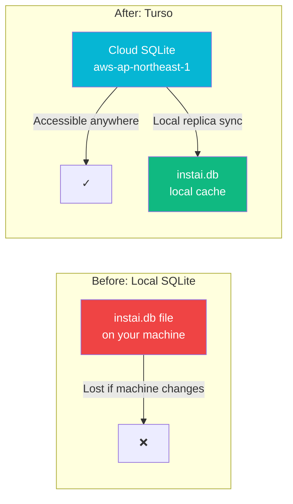
```mermaid
graph LR
    subgraph "Before: Local SQLite"
        A[instai.db file<br/>on your machine] -->|"Lost if machine changes"| X[❌]
    end

    subgraph "After: Turso"
        B[Cloud SQLite<br/>aws-ap-northeast-1] -->|"Accessible anywhere"| Y[✓]
        B -->|"Local replica sync"| C[instai.db<br/>local cache]
    end

    style A fill:#ef4444,color:#fff
    style B fill:#06b6d4,color:#fff
    style C fill:#10b981,color:#fff
```

Turso is **hosted SQLite** — same SQL syntax, same schema, but stored in the cloud. The Python client (`libsql_experimental`) is a drop-in replacement for Python's `sqlite3` module.

### How the Connection Works

```python
import libsql_experimental as libsql

# Connects to Turso cloud + keeps a local replica for speed
conn = libsql.connect(
    "instai.db",                          # Local replica file
    sync_url="libsql://instai-sokhi...",  # Turso cloud URL
    auth_token="eyJhbG..."               # Auth token
)
conn.sync()  # Sync local replica with cloud
```

The `libsql` client:
1. Keeps a **local SQLite file** as a replica
2. **Syncs writes** to Turso cloud
3. **Reads from local replica** when possible (fast!)
4. Falls back to local-only SQLite if Turso env vars aren't set

### Database Schema

```mermaid
erDiagram
    profiles {
        int id PK
        text ig_username UK "e.g. cristiano"
        text ig_pk "Instagram's internal user ID"
        text full_name
        text biography
        text profile_pic_url
        int follower_count
        int following_count
        int media_count
        int is_business "0 or 1"
        int is_private "0 or 1"
        text scraped_at "ISO timestamp"
        text updated_at "ISO timestamp"
    }

    posts {
        int id PK
        text ig_username FK
        text pk UK "Instagram's internal post ID"
        text code "Post shortcode (for URLs)"
        text taken_at "When posted"
        int media_type "1=photo 2=video 8=carousel"
        text thumbnail_url
        text video_url "Only for videos"
        int like_count
        int comment_count
        text caption_text
        text resources_json "Carousel images JSON"
        text updated_at
    }

    scrape_log {
        int id PK
        text ig_username
        text status "success/not_found/rate_limited/error"
        int post_count
        text error_message
        text scraped_at
    }

    profiles ||--o{ posts : "has many"
```

### Caching Strategy

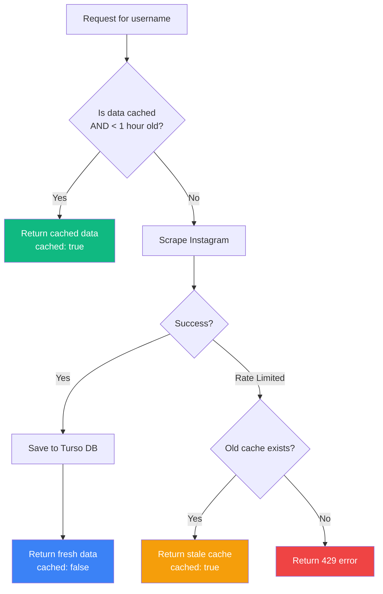
```mermaid
flowchart TD
    A[Request for username] --> B{Is data cached<br/>AND < 1 hour old?}
    B -->|Yes| C[Return cached data<br/>cached: true]
    B -->|No| D[Scrape Instagram]
    D --> E{Success?}
    E -->|Yes| F[Save to Turso DB]
    F --> G[Return fresh data<br/>cached: false]
    E -->|Rate Limited| H{Old cache exists?}
    H -->|Yes| I[Return stale cache<br/>cached: true]
    H -->|No| J[Return 429 error]

    style C fill:#10b981,color:#fff
    style G fill:#3b82f6,color:#fff
    style I fill:#f59e0b,color:#fff
    style J fill:#ef4444,color:#fff
```

**TTL (Time-To-Live): 1 hour** — after 1 hour, the next request triggers a fresh scrape.

---

## 6. The Image Proxy

### The Problem

Instagram images are hosted on their CDN (`*.cdninstagram.com`, `*.fbcdn.net`). When your browser tries to load these images directly from `localhost:3000`, Instagram blocks them because the `Referer` header says "this request came from localhost, not instagram.com."

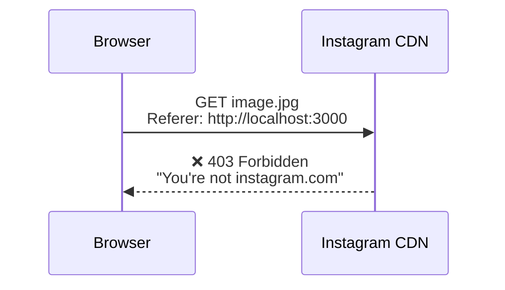
```mermaid
sequenceDiagram
    participant Browser
    participant Instagram CDN

    Browser->>Instagram CDN: GET image.jpg<br/>Referer: http://localhost:3000
    Instagram CDN-->>Browser: ❌ 403 Forbidden<br/>"You're not instagram.com"
```

### The Solution: Server-Side Proxy

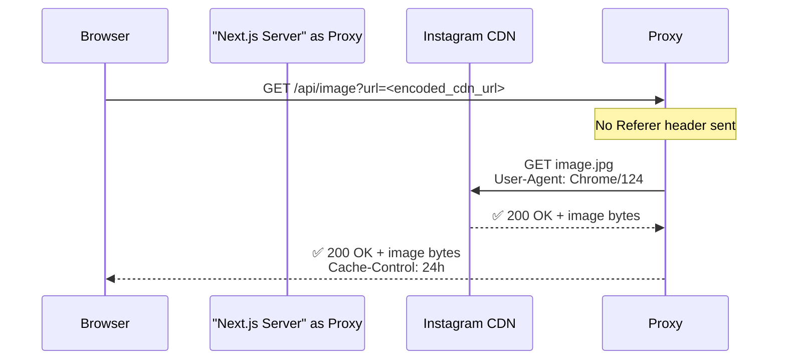
```mermaid
sequenceDiagram
    participant Browser
    participant "Next.js Server" as Proxy
    participant Instagram CDN

    Browser->>Proxy: GET /api/image?url=<encoded_cdn_url>
    Note over Proxy: No Referer header sent
    Proxy->>Instagram CDN: GET image.jpg<br/>User-Agent: Chrome/124
    Instagram CDN-->>Proxy: ✅ 200 OK + image bytes
    Proxy-->>Browser: ✅ 200 OK + image bytes<br/>Cache-Control: 24h
```

The proxy route (`app/api/image/route.ts`):
1. Receives the Instagram CDN URL as a query parameter
2. **Validates** it's from an allowed domain (security!)
3. Fetches the image **server-side** (no Referer = no block)
4. Returns the image bytes to the browser
5. Caches for 24 hours (`Cache-Control: public, max-age=86400`)

### Download Support

The same proxy handles downloads. Adding `?download=1&filename=post_ABC` makes it set `Content-Disposition: attachment`, which tells the browser to save the file instead of displaying it.

```
Display: /api/image?url=<cdn_url>
Download: /api/image?url=<cdn_url>&download=1&filename=post_ABC123
```

### Security: Domain Allowlist

The proxy only fetches from Instagram domains:

```typescript
const allowed =
    parsed.hostname.endsWith(".cdninstagram.com") ||
    parsed.hostname.endsWith(".fbcdn.net");

if (!allowed) return 403; // Reject non-Instagram URLs
```

This prevents the proxy from being abused as an open proxy to fetch arbitrary URLs.

---

## 7. The API Layer (FastAPI)

### Routes

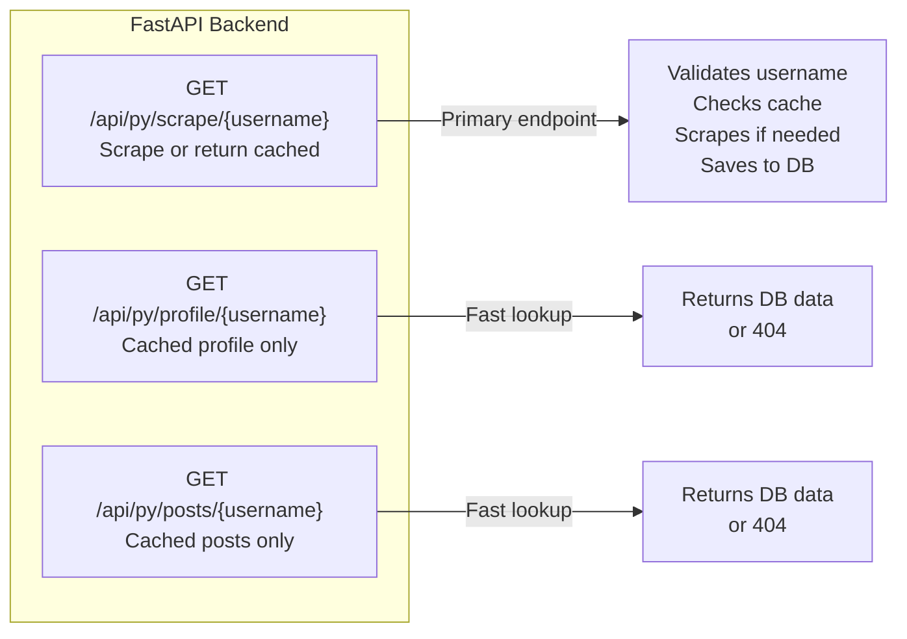
```mermaid
graph LR
    subgraph "FastAPI Backend"
        R1["GET /api/py/scrape/{username}<br/>Scrape or return cached"]
        R2["GET /api/py/profile/{username}<br/>Cached profile only"]
        R3["GET /api/py/posts/{username}<br/>Cached posts only"]
    end

    R1 -->|"Primary endpoint"| R1a[Validates username<br/>Checks cache<br/>Scrapes if needed<br/>Saves to DB]
    R2 -->|"Fast lookup"| R2a[Returns DB data<br/>or 404]
    R3 -->|"Fast lookup"| R3a[Returns DB data<br/>or 404]
```

### The `/scrape/{username}` Flow

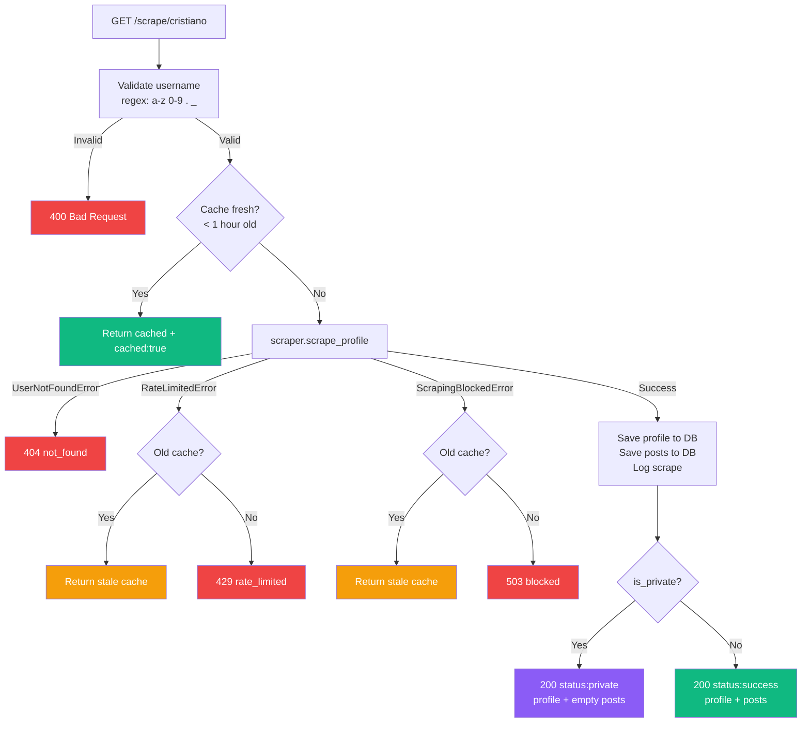
```mermaid
flowchart TD
    A[GET /scrape/cristiano] --> B[Validate username<br/>regex: a-z 0-9 . _]
    B -->|Invalid| C[400 Bad Request]
    B -->|Valid| D{Cache fresh?<br/>< 1 hour old}
    D -->|Yes| E[Return cached + cached:true]
    D -->|No| F[scraper.scrape_profile]
    F -->|UserNotFoundError| G[404 not_found]
    F -->|RateLimitedError| H{Old cache?}
    H -->|Yes| I[Return stale cache]
    H -->|No| J[429 rate_limited]
    F -->|ScrapingBlockedError| K{Old cache?}
    K -->|Yes| L[Return stale cache]
    K -->|No| M[503 blocked]
    F -->|Success| N[Save profile to DB<br/>Save posts to DB<br/>Log scrape]
    N --> O{is_private?}
    O -->|Yes| P[200 status:private<br/>profile + empty posts]
    O -->|No| Q[200 status:success<br/>profile + posts]

    style C fill:#ef4444,color:#fff
    style G fill:#ef4444,color:#fff
    style J fill:#ef4444,color:#fff
    style M fill:#ef4444,color:#fff
    style E fill:#10b981,color:#fff
    style I fill:#f59e0b,color:#fff
    style L fill:#f59e0b,color:#fff
    style P fill:#8b5cf6,color:#fff
    style Q fill:#10b981,color:#fff
```

### Concurrent Request Deduplication

If two users search for "cristiano" at the same time, we don't want to scrape Instagram twice. The scraper uses an in-memory lock:

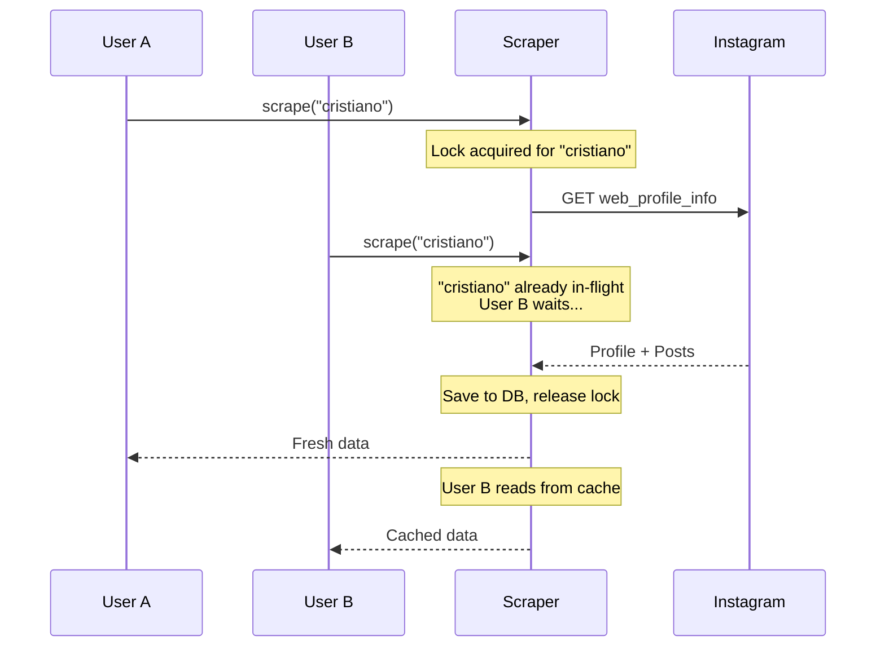
```mermaid
sequenceDiagram
    participant User A
    participant User B
    participant Scraper
    participant Instagram

    User A->>Scraper: scrape("cristiano")
    Note over Scraper: Lock acquired for "cristiano"
    Scraper->>Instagram: GET web_profile_info
    User B->>Scraper: scrape("cristiano")
    Note over Scraper: "cristiano" already in-flight<br/>User B waits...
    Instagram-->>Scraper: Profile + Posts
    Note over Scraper: Save to DB, release lock
    Scraper-->>User A: Fresh data
    Note over Scraper: User B reads from cache
    Scraper-->>User B: Cached data
```

---

## 8. The Frontend (Next.js)

### Page Structure

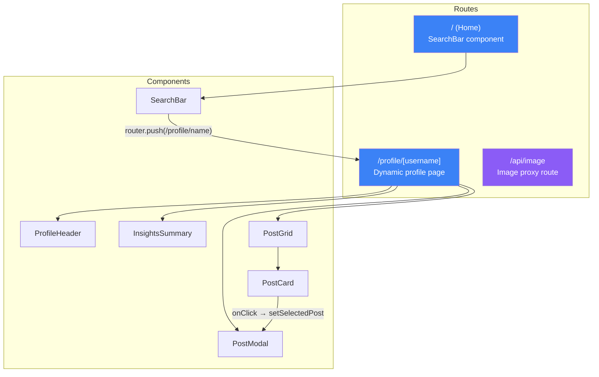
```mermaid
graph TD
    subgraph "Routes"
        P1["/ (Home)<br/>SearchBar component"]
        P2["/profile/[username]<br/>Dynamic profile page"]
        P3["/api/image<br/>Image proxy route"]
    end

    subgraph "Components"
        C1[SearchBar]
        C2[ProfileHeader]
        C3[InsightsSummary]
        C4[PostGrid]
        C5[PostCard]
        C6[PostModal]
    end

    P1 --> C1
    P2 --> C2
    P2 --> C3
    P2 --> C4
    C4 --> C5
    P2 --> C6

    C1 -->|"router.push(/profile/name)"| P2
    C5 -->|"onClick → setSelectedPost"| C6

    style P1 fill:#3b82f6,color:#fff
    style P2 fill:#3b82f6,color:#fff
    style P3 fill:#8b5cf6,color:#fff
```

### SearchBar Input Handling

The SearchBar is smart about input:

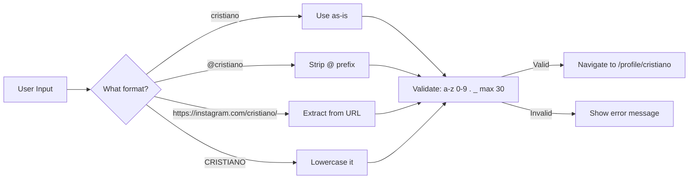
```mermaid
flowchart LR
    A[User Input] --> B{What format?}
    B -->|"cristiano"| C[Use as-is]
    B -->|"@cristiano"| D[Strip @ prefix]
    B -->|"https://instagram.com/cristiano/"| E[Extract from URL]
    B -->|"CRISTIANO"| F[Lowercase it]
    C --> G[Validate: a-z 0-9 . _ max 30]
    D --> G
    E --> G
    F --> G
    G -->|Valid| H[Navigate to /profile/cristiano]
    G -->|Invalid| I[Show error message]
```

### Profile Page States

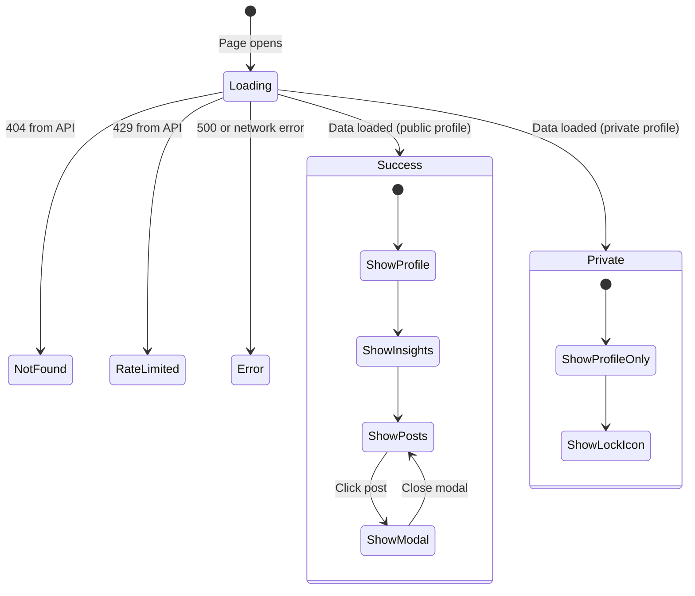
```mermaid
stateDiagram-v2
    [*] --> Loading : Page opens
    Loading --> Success : Data loaded (public profile)
    Loading --> Private : Data loaded (private profile)
    Loading --> NotFound : 404 from API
    Loading --> RateLimited : 429 from API
    Loading --> Error : 500 or network error

    state Success {
        [*] --> ShowProfile
        ShowProfile --> ShowInsights
        ShowInsights --> ShowPosts
        ShowPosts --> ShowModal : Click post
        ShowModal --> ShowPosts : Close modal
    }

    state Private {
        [*] --> ShowProfileOnly
        ShowProfileOnly --> ShowLockIcon
    }
```

### Component Hierarchy

```
ProfilePage
├── "← Search another profile" link
├── [cached] badge (if serving cached data)
├── ProfileHeader
│   ├── Profile Picture (with download icon on hover)
│   ├── Username
│   ├── Stats: posts | followers | following
│   ├── Full Name
│   └── Biography
├── InsightsSummary
│   ├── Total Likes
│   ├── Total Comments
│   ├── Avg Likes/Post
│   ├── Avg Comments/Post
│   └── Best Post Engagement
├── PostGrid (3-column grid)
│   └── PostCard (for each post)
│       ├── Thumbnail Image
│       ├── Media Type Icon (top-right: play/carousel)
│       ├── Download Icon (top-left, on hover)
│       └── Engagement Overlay (on hover: likes + comments)
└── PostModal (when post clicked)
    ├── Media (image or video player)
    ├── Download Button
    ├── Likes + Comments
    ├── Caption
    └── Date
```

---

## 9. Data Flow: End to End

### First Visit (Cold Cache)

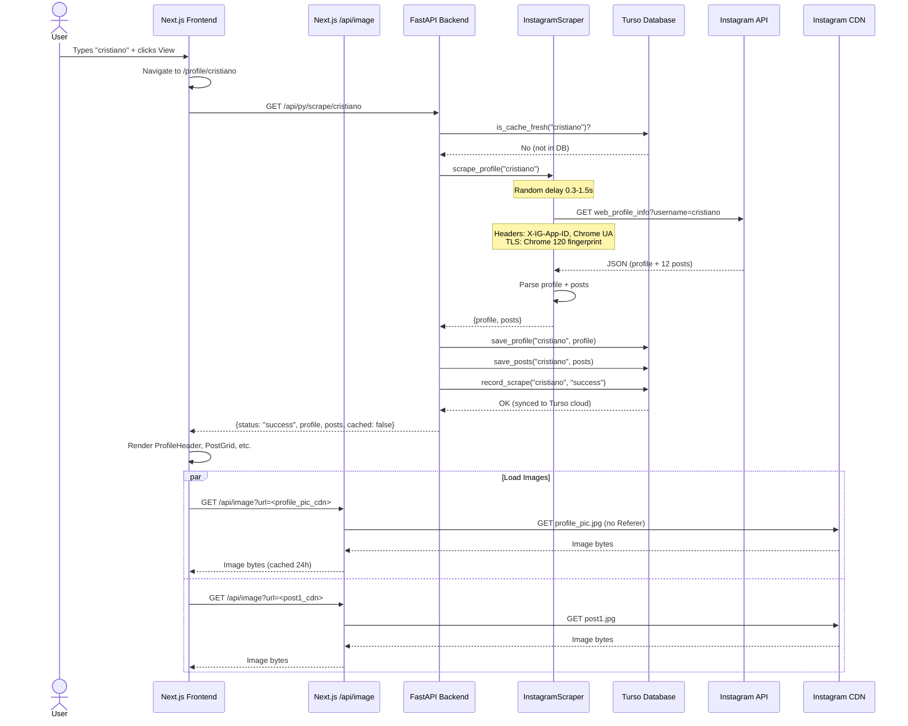
```mermaid
sequenceDiagram
    actor User
    participant Browser as Next.js Frontend
    participant Proxy as Next.js /api/image
    participant API as FastAPI Backend
    participant Scraper as InstagramScraper
    participant DB as Turso Database
    participant IG as Instagram API
    participant CDN as Instagram CDN

    User->>Browser: Types "cristiano" + clicks View
    Browser->>Browser: Navigate to /profile/cristiano
    Browser->>API: GET /api/py/scrape/cristiano
    API->>DB: is_cache_fresh("cristiano")?
    DB-->>API: No (not in DB)
    API->>Scraper: scrape_profile("cristiano")
    Note over Scraper: Random delay 0.3-1.5s
    Scraper->>IG: GET web_profile_info?username=cristiano
    Note over Scraper: Headers: X-IG-App-ID, Chrome UA<br/>TLS: Chrome 120 fingerprint
    IG-->>Scraper: JSON (profile + 12 posts)
    Scraper->>Scraper: Parse profile + posts
    Scraper-->>API: {profile, posts}
    API->>DB: save_profile("cristiano", profile)
    API->>DB: save_posts("cristiano", posts)
    API->>DB: record_scrape("cristiano", "success")
    DB-->>API: OK (synced to Turso cloud)
    API-->>Browser: {status: "success", profile, posts, cached: false}
    Browser->>Browser: Render ProfileHeader, PostGrid, etc.

    par Load Images
        Browser->>Proxy: GET /api/image?url=<profile_pic_cdn>
        Proxy->>CDN: GET profile_pic.jpg (no Referer)
        CDN-->>Proxy: Image bytes
        Proxy-->>Browser: Image bytes (cached 24h)
    and
        Browser->>Proxy: GET /api/image?url=<post1_cdn>
        Proxy->>CDN: GET post1.jpg
        CDN-->>Proxy: Image bytes
        Proxy-->>Browser: Image bytes
    end
```

### Repeat Visit (Warm Cache)

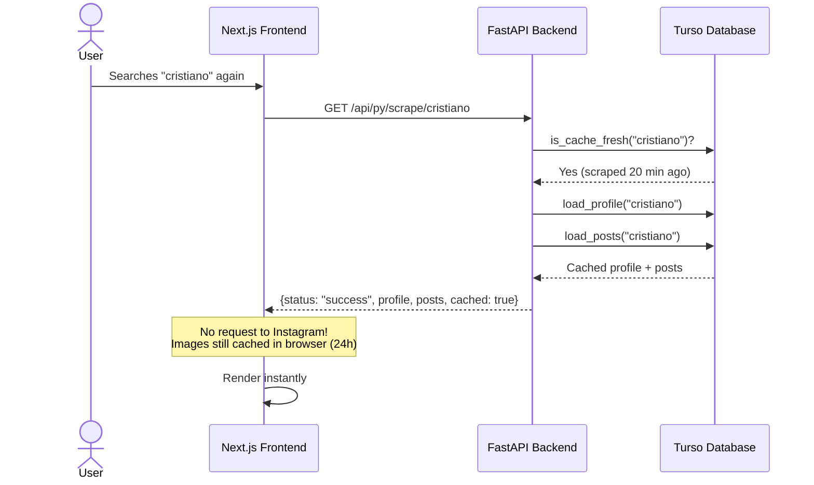
```mermaid
sequenceDiagram
    actor User
    participant Browser as Next.js Frontend
    participant API as FastAPI Backend
    participant DB as Turso Database

    User->>Browser: Searches "cristiano" again
    Browser->>API: GET /api/py/scrape/cristiano
    API->>DB: is_cache_fresh("cristiano")?
    DB-->>API: Yes (scraped 20 min ago)
    API->>DB: load_profile("cristiano")
    API->>DB: load_posts("cristiano")
    DB-->>API: Cached profile + posts
    API-->>Browser: {status: "success", profile, posts, cached: true}
    Note over Browser: No request to Instagram!<br/>Images still cached in browser (24h)
    Browser->>Browser: Render instantly
```

### Download Flow

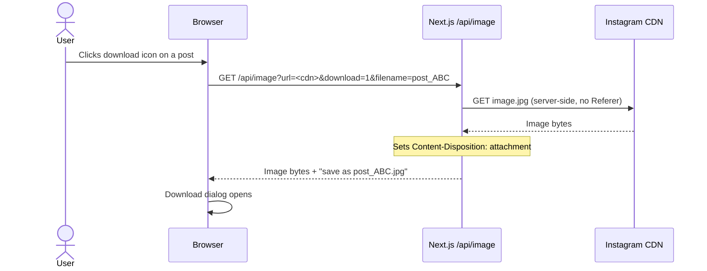
```mermaid
sequenceDiagram
    actor User
    participant Browser
    participant Proxy as Next.js /api/image
    participant CDN as Instagram CDN

    User->>Browser: Clicks download icon on a post
    Browser->>Proxy: GET /api/image?url=<cdn>&download=1&filename=post_ABC
    Proxy->>CDN: GET image.jpg (server-side, no Referer)
    CDN-->>Proxy: Image bytes
    Note over Proxy: Sets Content-Disposition: attachment
    Proxy-->>Browser: Image bytes + "save as post_ABC.jpg"
    Browser->>Browser: Download dialog opens
```

---

## 10. Setbacks & How We Solved Them

### Setback 1: The Login Approach Was Too Risky

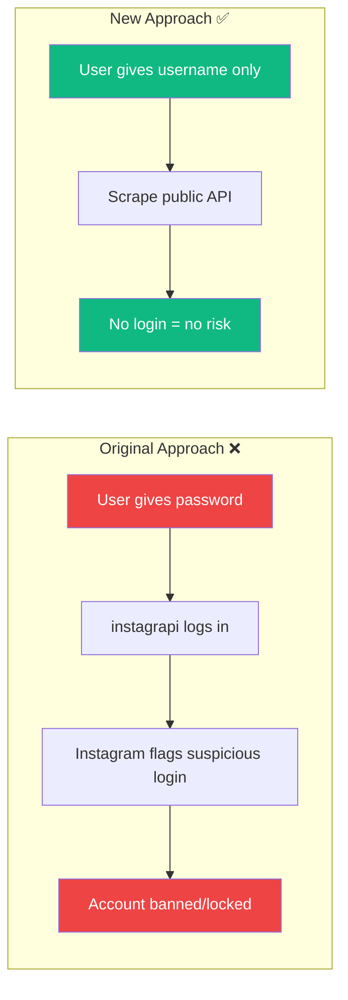
```mermaid
graph LR
    subgraph "Original Approach ❌"
        A[User gives password] --> B[instagrapi logs in]
        B --> C[Instagram flags suspicious login]
        C --> D[Account banned/locked]
    end

    subgraph "New Approach ✅"
        E[User gives username only] --> F[Scrape public API]
        F --> G[No login = no risk]
    end

    style A fill:#ef4444,color:#fff
    style D fill:#ef4444,color:#fff
    style E fill:#10b981,color:#fff
    style G fill:#10b981,color:#fff
```

**Problem:** Using `instagrapi` to log into Instagram with user credentials caused:
- Suspicious login blocks (Instagram detected non-standard login)
- Account bans
- Required handling 2FA/challenge flows
- Users had to share their passwords (trust issue)

**Solution:** Pivoted to scraping public data only. No login needed. Legally safer (per *Meta v. Bright Data* 2024 ruling). Better UX (just enter a username).

---

### Setback 2: Python's HTTP Clients Get Detected

**Problem:** Instagram detects bot traffic at the **TLS handshake level** — before any HTTP headers are even inspected. Python's `requests` library has a unique TLS fingerprint that Instagram blocks immediately.

```
Python requests → TLS fingerprint → Instagram: "This is a bot" → 403 Blocked
```

**Solution:** Used `curl_cffi` with `impersonate="chrome120"` which produces an identical TLS fingerprint to real Chrome. Instagram cannot distinguish our requests from a real browser.

```
curl_cffi (chrome120) → TLS fingerprint → Instagram: "This is Chrome" → 200 OK
```

---

### Setback 3: Instagram Images Wouldn't Load

**Problem:** After scraping worked, images showed as broken in the browser. Instagram's CDN checks the `Referer` header and blocks requests from non-Instagram domains.

```
Browser on localhost:3000 → loads img from cdninstagram.com
                          → Referer: http://localhost:3000
                          → CDN: "Not from instagram.com" → 403
```

**Solution:** Created a Next.js API route (`/api/image`) that proxies images server-side. The server fetches from Instagram's CDN without a Referer header, then forwards the image bytes to the browser.

```
Browser → /api/image?url=<cdn_url> → Next.js server → CDN (no Referer) → 200 OK
```

---

### Setback 4: Local SQLite Isn't Portable

**Problem:** SQLite stores data in a local file (`instai.db`). If you deploy to Vercel or switch machines, the data is lost.

**Solution:** Migrated to **Turso** — cloud-hosted SQLite. Same SQL, same schema, but stored remotely. The `libsql_experimental` Python package is a drop-in replacement for `sqlite3`.

Key challenge: `libsql_experimental` returns tuples instead of `sqlite3.Row` objects (no dict-like `row["column"]` access). We wrote helper functions (`_fetchone_dict`, `_fetchall_dicts`) that use `cursor.description` to convert tuples to dicts.

---

### Setback 5: `libsql` Returns Tuples, Not Row Objects

**Problem:** After switching from `sqlite3` to `libsql_experimental`, all queries broke because `libsql` doesn't support `row_factory = sqlite3.Row`. Results come back as plain tuples:

```python
# sqlite3 (old) — dict-like access
row["username"]  # Works ✓

# libsql (new) — tuple access only
row["username"]  # TypeError ✗
row[0]           # Works but fragile
```

**Solution:** Built helper functions that read column names from `cursor.description` and zip them with row values:

```python
def _fetchone_dict(conn, query, params=()):
    cursor = conn.execute(query, params)
    row = cursor.fetchone()
    if not row:
        return None
    columns = [desc[0] for desc in cursor.description]
    return dict(zip(columns, row))
    # Now: {"username": "cristiano", "follower_count": 648000000}
```

---

## 11. File Map

```
instai/
├── api/                          # Python backend
│   ├── index.py                  # FastAPI app + 3 routes
│   └── utils/
│       ├── scraper.py            # InstagramScraper (curl_cffi)
│       └── database.py           # Turso/SQLite operations
│
├── app/                          # Next.js pages
│   ├── layout.tsx                # Root layout (fonts, metadata)
│   ├── page.tsx                  # Home page (SearchBar)
│   ├── api/
│   │   └── image/
│   │       └── route.ts          # Image proxy + download handler
│   └── profile/
│       └── [username]/
│           └── page.tsx          # Dynamic profile page
│
├── components/                   # React components
│   ├── SearchBar.tsx             # Username input + URL parsing
│   ├── ProfileHeader.tsx         # Avatar + stats + bio + download
│   ├── PostGrid.tsx              # 3-column post grid
│   ├── PostCard.tsx              # Post thumbnail + download icon
│   ├── PostModal.tsx             # Full post view + download button
│   └── InsightsSummary.tsx       # Analytics cards
│
├── lib/                          # Shared utilities
│   ├── api.ts                    # API client (scrapeProfile, etc.)
│   ├── types.ts                  # TypeScript types (Profile, Post)
│   └── image.ts                  # proxyImageUrl, downloadUrl helpers
│
├── .env.local                    # TURSO_DATABASE_URL, TURSO_AUTH_TOKEN
├── next.config.ts                # Rewrites, image domains
├── vercel.json                   # Vercel deployment config
├── requirements.txt              # Python deps (4 packages)
├── package.json                  # Node deps (Next.js 16, React 19)
└── docs/
    ├── discussions/
    │   └── 001-instagram-scraping-architecture.md
    └── how-instai-works.md       # ← You are here
```

---

## Key Takeaways

1. **One API call gets everything** — Instagram's `web_profile_info` returns profile + ~12 posts in a single request.

2. **TLS fingerprinting is the real defense** — not rate limits, not CAPTCHAs. `curl_cffi` solves this by impersonating Chrome's TLS handshake.

3. **Images need a proxy** — Instagram CDN blocks cross-origin image loading via Referer checks. Our Next.js API route fetches server-side.

4. **Cache aggressively** — 1-hour TTL for profile data, 24-hour browser cache for images. Most requests never hit Instagram.

5. **Turso = SQLite in the cloud** — same syntax, same schema, just swap the connection function. Free tier is 9GB.

6. **Public scraping is legally defensible** — *Meta v. Bright Data* (2024) established that scraping public Instagram data while logged out does not violate Meta's Terms of Service.
